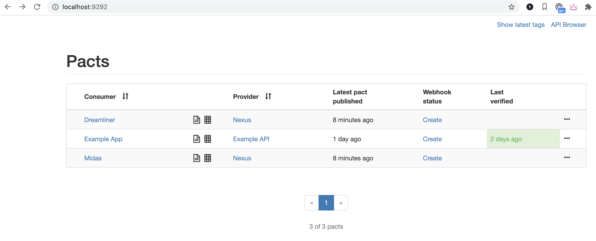
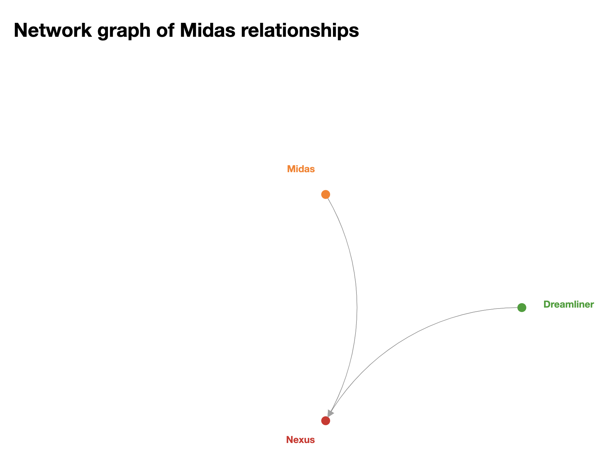

# Contract Testing with Node.js and Pact

## Start Pact

```
docker-compose up -d
```
check if docker containers are up

```
docker ps
```

## Run consumer tests
```
npm run test:consumer
```

## Run provider tests
```
npm run test:provider
```

check the pacts here [Pacts](http://localhost:9292/)



